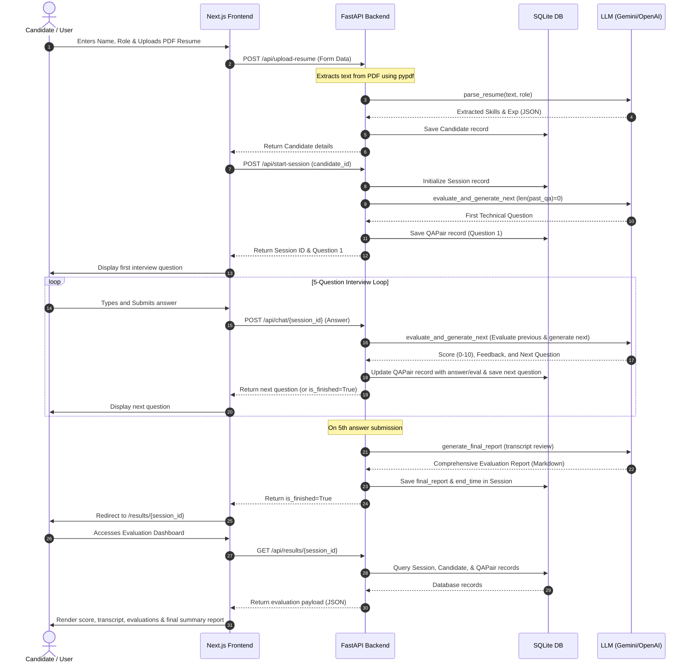

# ScreenR AI – Intelligent Technical Interview Screening Platform

An AI-powered interview screening platform that simulates role-based technical interviews using Large Language Models and Retrieval-Augmented Generation (RAG).

---

## Overview

ScreenR AI is designed to make the initial technical screening process smarter, more adaptive, and personalized. Instead of asking generic interview questions, the system dynamically generates questions based on the candidate’s resume, extracted skills, and the selected job role.

The platform combines LLMs with a role-specific knowledge base to create a realistic interview experience that adapts to candidate responses in real time.

The main idea behind this project was to build a system that goes beyond static questionnaires and behaves more like an intelligent interviewer capable of understanding context, evaluating answers, and guiding the interview flow naturally.

---

## Frontend First Page (Onboarding UI)

The entry point of the platform is a polished candidate onboarding portal where candidates register and submit credentials:

* **Name Input**: Collects the candidate's name to personalize the interview experience.
* **Target Role Dropdown**: Supports selecting specialized career tracks (e.g., **Backend Engineer**, **AI/ML Engineer**, or **Data Scientist**).
* **Resume Dropzone**: Accepts technical resumes in PDF format.
* **Interactive Submission Flow**:
  1. Parses PDF text using `pypdf` on the backend.
  2. Sends text to the LLM to extract key skills/languages.
  3. Creates a `Candidate` database record.
  4. Automatically starts a new active `Session` and generates the first question.
  5. Smoothly transitions the candidate to the Live Interview screen.

---

## System Flow Architecture

The platform separates responsibilities between the client interface, API backend, local database storage, and AI providers:

---

## Tech Stack

### Frontend
* **Next.js (App Router)**: Fast, server-rendered React framework.
* **Tailwind CSS**: Modern utility-first CSS styling for a responsive, clean user experience.

### Backend
* **FastAPI**: Lightweight, async Python framework for low-latency REST APIs.
* **LangChain**: AI orchestration tool to manage LLM chains, prompts, and vector store operations.
* **SQLAlchemy**: Python SQL toolkit and Object Relational Mapper (ORM) to interact with SQLite.
* **ChromaDB**: In-memory/local vector database for semantic search and Retrieval-Augmented Generation (RAG).

### AI & LLM Support
* **Google Gemini** (via `langchain-google-genai`)
* **OpenAI** (via `langchain-openai`)

---

## Key Features

* **AI-Generated Adaptive Technical Interviews**: Tailored topics based on candidate profile and response feedback.
* **Resume-Based Skill Extraction**: Automatically parses, structures, and logs developer skills from PDFs.
* **RAG-Powered Contextual Retrieval**: Matches candidate skills to textbooks or training datasets to form challenging questions.
* **Dynamic Answer Evaluation**: Rates responses (0-10) with constructive feedback in real time.
* **Session Persistence**: Maintains session records and evaluations in a relational database for recruiter review.
* **Graceful Demo Fallback**: Operates cleanly using built-in interactive mock interview sequences when LLM API keys are absent.

---

## Design Decisions

### Decoupled Frontend & Backend
The frontend and backend were separated intentionally to keep the UI responsive while allowing the backend to independently handle AI processing and scaling.

### RAG-Based Knowledge Retrieval
The system uses ChromaDB with LangChain to retrieve contextual information from role-specific learning resources and textbooks. This improves the quality and relevance of generated interview questions.

### Flexible LLM Integration
LangChain was used to simplify switching between Gemini and OpenAI models depending on availability and use case.

### Persistent State Management
SQLite was chosen instead of temporary in-memory storage so interview sessions and evaluation reports could be stored reliably for future expansion.

---

## Future Improvements

* Voice-based interview support
* Real-time coding assessments
* AI-generated hiring recommendations
* Emotion and confidence analysis
* Multi-round interview workflows
* Recruiter dashboard and analytics
* ATS integration

---

## Why I Built This

I wanted to explore how AI can improve technical hiring by creating more personalized and context-aware interview experiences. Traditional screening systems often rely on fixed question banks, which fail to evaluate candidates dynamically.

This project helped me gain hands-on experience with:
* LLM workflows
* RAG architectures
* Vector databases
* AI evaluation pipelines
* Full-stack AI system design

More importantly, it gave me insight into how intelligent systems can be designed to simulate real-world interactions in a scalable way.
